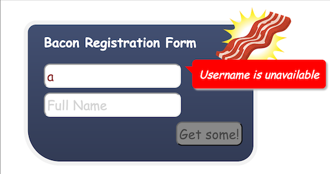
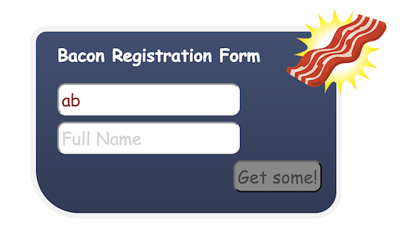
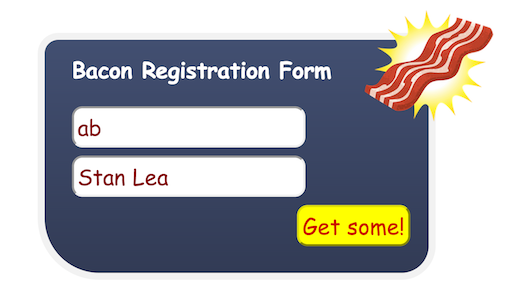
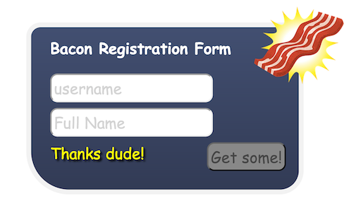

## Extracting some patterns and using Bacon.Model to manage state

 
 

          function wireAjaxOnChange(input, urlFunc, init) {
              var request = input.changes().filter(nonEmpty).skipDuplicates()
                      .throttle(300)
                      .map(urlFunc)

              var response = request.ajax()

              return {
                  requestEntered: input.map(nonEmpty),
                  responsePending: request.awaiting(response),
                  responseValue: response.toProperty(init)
              }
          }

          function wireAjaxOnEvent(eventSource, eventName, url, dataFormula) {
              var event = eventSource.asEventStream(eventName).doAction(".preventDefault")
              var request = Bacon.combineTemplate({
                  type: "post",
                  url : url,
                  contentType: "application/json",
                  data: JSON.stringify(dataFormula)
              }).sampledBy(event)
              var response = request.ajax()

              return {
                  requestEntered: request.map(true).toProperty(false),
                  responsePending: request.awaiting(response),
                  responseStream: response
              }
          }
Usage:

        usernameField = $("#username input")
        fullnameField = $("#fullname input")
        username = Bacon.$.textFieldValue(usernameField)
        fullname = Bacon.$.textFieldValue(fullnameField)

        userNameWire = wireAjaxOnChange(username,
            function(user) { return { url : "/usernameavailable/" + user } }, true)

        usernameEntered = userNameWire.requestEntered
        usernameAvailable = userNameWire.responseValue
        availabilityPending = userNameWire.responsePending

        //model

        model = Bacon.Model.combine({username: username, fullname: fullname})
        model.onValue(function(m) {
            $("#result").text("")
            console.log("model", m)
        })

        // registration
        var registrationWire = wireAjaxOnEvent(registerButton, "click", "/register", model.get())

        registrationPending = registrationWire.responsePending
        registrationSent = registrationWire.requestEntered
        registrationResponse = registrationWire.responseStream

        registrationResponse.onValue(function() {
            model.set({username: "", fullname: ""})
            $("#result").text("Thanks dude!")
        })

## The Assignment

Implement a Registration Form that

* Has input fields for username and fullname
* Verifies username availability using `GET /usernameavailable/<username>`
* Shows "Username is unavailable" text if username is unavailable
* Sends registration when Register button is pressed, using `POST
  /register { username: x, fullname: y }`
* Shows a feedback "Thanks!" when registration is complete
* Enables Register button only if both informations are entered and
  username is available
* Shows AJAX loading indicators beside the username field (when
  verifying) and the Register button (when registering)
* Disables the Register button also when either registration or username
  verification is pending

## Preparations

* Get a browser with developer tools (Chrome will do)
* Read the README of [Bacon.js](https://github.com/raimohanska/bacon.js)
* Clone this repo
* Open [index.html](index.html)

## Starting point

* [HTML page](index.html) with the required form elements
* Javascript imports for Bacon.js, bacon.jquery.js, jQuery.js
* Javascript stub embedded in the HTML file
* Implementation of the username property
* The required AJAX services are mocked for you using [Mockjax](https://github.com/appendto/jquery-mockjax), so you don't need any background server.

## Guidelines / intro

I usually start by defining some streams, at this point as global/window
variables, so that I can debug them easier. I included a `show` function
in the stub, so that you can debug your streams easily like this:

    username.onValue(show)

This would lead to all events appearing in the "username" stream to be
printed to the console.

## Suggested steps

* Disable button when username is empty (tips: usernameMissing property,
  map, onValue)
* Disable also if fullname if missing (tips: new properties,
  Property.or)
* Implement availability query (tips: map, ajax)
* Disable button if username unavailable (tips: Property.or,
  Property.not)
* Show unavailability information (tips: onValue, "toggle")
* What happens with empty username? How to fix? (tips: filter)
* Show AJAX indicator when AJAX pending (tips: map, merge, toProperty)
* Disable button when AJAX is pending
* Implement registerClick stream (tips: preventDefault)
* Implement registration request stream(tips: combineTemplate, sampledBy)
* Send POST request to server (tips: switch, $.ajax, type="post")
* Show registration feedback (tips: onValue, $.text)
